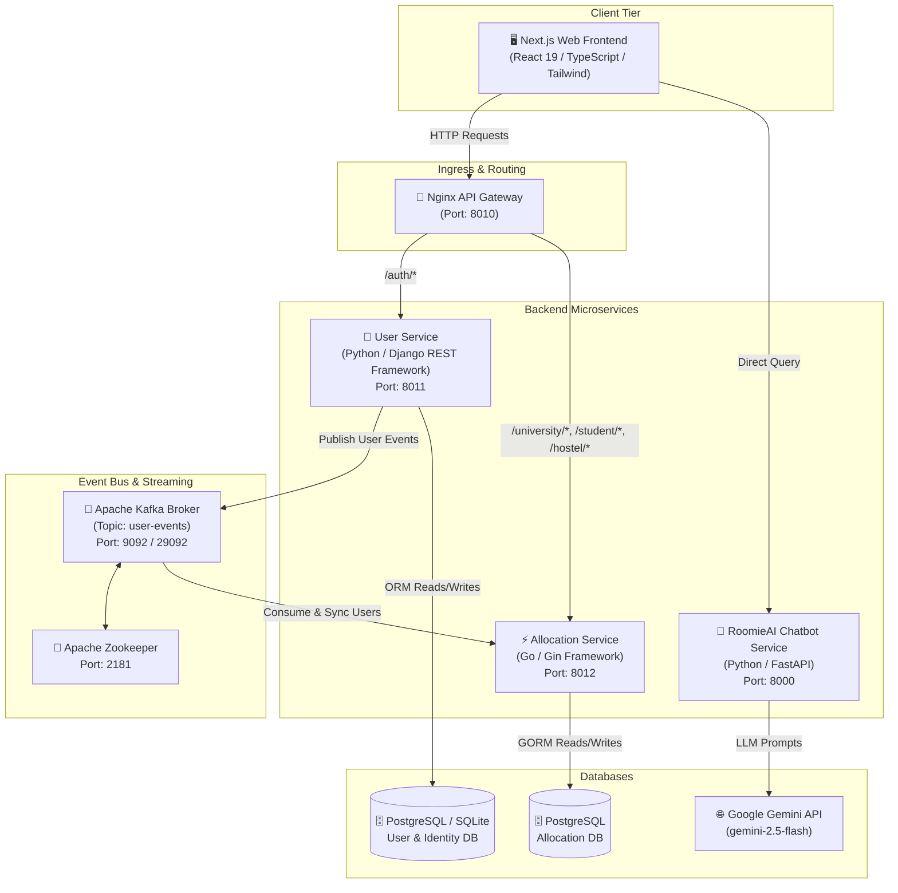
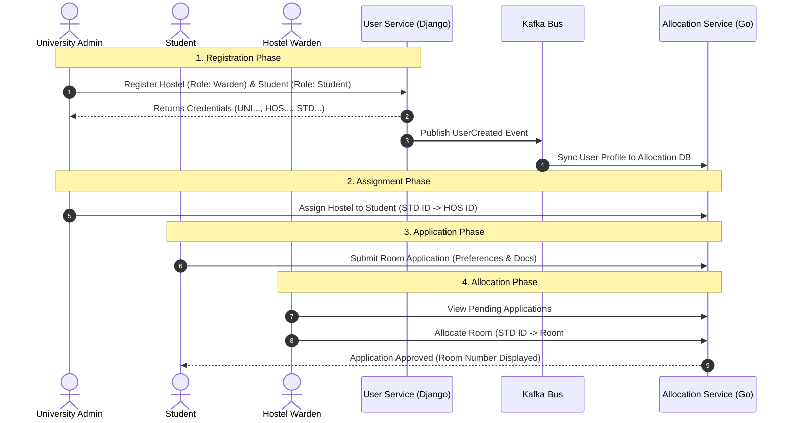

# 🏢 HostelNET — Distributed Hostel Management & Room Allocation Platform

**HostelNET** is an enterprise-grade, polyglot microservices platform engineered for modern hostel management and room allocation across universities, hostel wardens, and students. Built with an **Event-Driven Architecture (EDA)**, **Apache Kafka messaging**, an **Nginx API Gateway**, high-concurrency **Go microservices**, **Django Auth**, and an integrated **Google Gemini AI Assistant (RoomieAI)**.

---

## 📐 System Architecture Diagram



---

## 🏛️ Service Responsibilities & Component Breakdown

### 1. 🚪 Nginx API Gateway (`nginx/`)
* **Port**: `8010` (Docker Container: `hostelnet_gateway`)
* **Responsibilities**:
  * Acts as the single entry point for all frontend API requests.
  * Hides internal microservice topology and ports from public exposure.
  * Centralizes **CORS (Cross-Origin Resource Sharing)** policy configuration.
  * Route dispatching:
    * `/auth/*` → Routes to **User Service** (`host.docker.internal:8011`).
    * `/university/*`, `/student/*`, `/hostel/*` → Routes to **Allocation Service** (`host.docker.internal:8012`).

---

### 2. 🔐 User Service — Auth & Identity (`backend1/Services/Service-User/`)
* **Tech Stack**: Python 3.x, Django REST Framework (Function-Based Views), `djangorestframework-simplejwt`, SQLite / PostgreSQL
* **Port**: `8011`
* **Responsibilities**:
  * **Authentication & Authorization**: Manages user signups, logins, and issues JWT tokens containing claims (`username`, `email`, `role`).
  * **Role-Based Unique ID Generation**: Automatically generates system-wide unique identifiers prefixed by role (e.g., `UNI...` for Universities, `HOS...` for Hostels, `STD...` for Students).
  * **Event Production**: Uses `confluent_kafka` to publish domain events (`UserCreated`, `UserUpdated`, `UserDeleted`) onto the `user-events` Kafka topic.

---

### 3. ⚡ Allocation Service — Core Business Operations (`backend1/Services/Service-Allocation-Go/`)
* **Tech Stack**: Go (Golang 1.20+), Gin Web Framework, GORM, PostgreSQL
* **Port**: `8012`
* **Responsibilities**:
  * High-concurrency service handling core domain models: Hostels, Rooms, Beds, Applications, Allocations, Students, and Universities.
  * **JWT Validation Middleware**: Intercepts requests, validates token signatures, and enforces role permissions across `/university`, `/student`, and `/hostel` routes.
  * **Kafka Consumer Engine**: Listens to the `user-events` topic (`allocation_service_go_group`) to asynchronously sync user records from the User Service into its local PostgreSQL database.

---

### 4. 🤖 RoomieAI Service — Context-Aware Assistant (`backend1/Services/Service-Chatbot/`)
* **Tech Stack**: Python 3.x, FastAPI, Uvicorn, Google Gemini 2.5 Flash SDK (`google-genai`)
* **Port**: `8000`
* **Responsibilities**:
  * Provides persona-tailored interactive assistance for Students, Hostel Wardens, and University Admins.
  * Guides users step-by-step through room application, warden allocations, hostel assignments, and troubleshooting edge cases.

---

### 5. 📩 Apache Kafka Messaging Cluster (`docker-compose-kafka.yml`)
* **Tech Stack**: Apache Kafka (`confluentinc/cp-kafka:7.4.0`) + Apache Zookeeper
* **Ports**: Zookeeper (`2181`), Kafka Broker (`9092` external, `29092` internal)
* **Responsibilities**:
  * Provides an asynchronous event log for event-driven synchronization between microservices (Database-per-Service pattern).
  * Topic: `user-events`.

---

### 6. 💻 Frontend Web Portal (`Frontend/hostelnet-frontend/`)
* **Tech Stack**: Next.js (App Router), React 19, TypeScript, Tailwind CSS, Shadcn UI, Motion, Lucide React
* **Responsibilities**:
  * Responsive web dashboard supporting three dedicated role portals:
    * **University Portal**: Register hostels, generate student IDs, assign hostels to students.
    * **Hostel Warden Portal**: Manage room inventory (capacity, type, floor), process applications, allocate/reallocate rooms.
    * **Student Portal**: Check assigned hostel, complete application forms, state roommate preferences, track room allocation.
  * Interactive embedded **RoomieAI Chat Modal** for real-time guidance.

---

## 👥 Role-Based Workflows



---

## 🛠️ Technology Stack Summary

| Layer | Technology |
|---|---|
| **Frontend** | Next.js 15, React 19, TypeScript, Tailwind CSS, Motion |
| **API Gateway** | Nginx (Alpine Container) |
| **Auth & User Service** | Python, Django REST Framework (FBVs), `djangorestframework-simplejwt`, confluent-kafka |
| **Core Allocation Service**| Go (Golang), Gin Framework, GORM, `segmentio/kafka-go` |
| **AI Assistant Service** | Python, FastAPI, Uvicorn, Google Gemini API (`gemini-2.5-flash`) |
| **Message Broker** | Apache Kafka, Apache Zookeeper |
| **Databases** | PostgreSQL, SQLite |
| **Containerization** | Docker, Docker Compose |

---

## 📡 Key API Routes

### 🔐 User & Authentication Service (`/auth/*` via Gateway `:8010`)
| Method | Route | Description |
|---|---|---|
| `POST` | `/auth/register` | Register a user (University, Hostel, or Student) & issue JWT token |
| `POST` | `/auth/get_users` | Batch retrieve user details by ID list |

### ⚡ Allocation Service (`:8010`)
| Method | Route | Description | Required Role |
|---|---|---|---|
| `POST` | `/university/register-hostel` | Register a hostel under university | University Admin |
| `POST` | `/university/register-student` | Register a student under university | University Admin |
| `POST` | `/university/assign-hostel` | Link a student to a specific hostel | University Admin |
| `POST` | `/hostel/rooms` | Create rooms with capacity & floor | Hostel Warden |
| `GET` | `/hostel/applications` | View pending hostel applications | Hostel Warden |
| `POST` | `/hostel/allocate` | Allocate a specific room to a student | Hostel Warden |
| `POST` | `/student/apply` | Submit hostel allocation application | Student |
| `GET` | `/student/my-allocation` | Check assigned room and status | Student |

### 🤖 RoomieAI Assistant Service (`:8000`)
| Method | Route | Description |
|---|---|---|
| `GET` | `/roomieAI?query=...` | AI query assistant powered by Gemini 2.5 Flash |

---

## 🚀 Local Development Setup & Launch Guide

### Prerequisites
* [Docker & Docker Compose](https://docs.docker.com/get-docker/)
* [Go 1.20+](https://go.dev/doc/install)
* [Python 3.10+](https://www.python.org/downloads/)
* [Node.js 18+](https://nodejs.org/)

---

### Step 1: Start Infrastructure (Kafka, Zookeeper, Nginx Gateway)

```bash
# 1. Start Kafka & Zookeeper Cluster
docker compose -f docker-compose-kafka.yml up -d

# 2. Start Nginx Gateway
docker compose -f docker-compose.yml up -d
```

---

### Step 2: Launch User Service (Django)

```bash
cd backend1/Services/Service-User/UserService

# Create virtual environment & install requirements
python -m venv venv
source venv/bin/activate  # On Windows: venv\Scripts\activate
pip install -r ../requirements.txt

# Run migrations & start server on port 8011
python manage.py migrate
python manage.py runserver 8011
```

---

### Step 3: Launch Allocation Service (Go)

```bash
cd backend1/Services/Service-Allocation-Go

# Copy or configure .env file
# Ensure KAFKA_BROKER_URL=localhost:9092 and DATABASE_URL is set

go run main.go
# Starts Allocation Service on port 8012
```

---

### Step 4: Launch RoomieAI Service (FastAPI)

```bash
cd backend1/Services/Service-Chatbot/RoomieAI

# Install requirements & set Gemini API Key
pip install -r ../requirements.txt
export GEMINI_API_KEY="your_gemini_api_key_here"  # On Windows set GEMINI_API_KEY="..."

# Run FastAPI app with uvicorn on port 8000
uvicorn main:app --reload --port 8000
```

---

### Step 5: Launch Next.js Frontend

```bash
cd Frontend/hostelnet-frontend

# Install dependencies
npm install

# Start Next.js development server
npm run dev
```
Access the application in your browser at `http://localhost:3000`.

---

## 🤝 Contributing & License
Distributed under the MIT License. Built for scalable hostel management and modern microservice architecture demonstrations.
